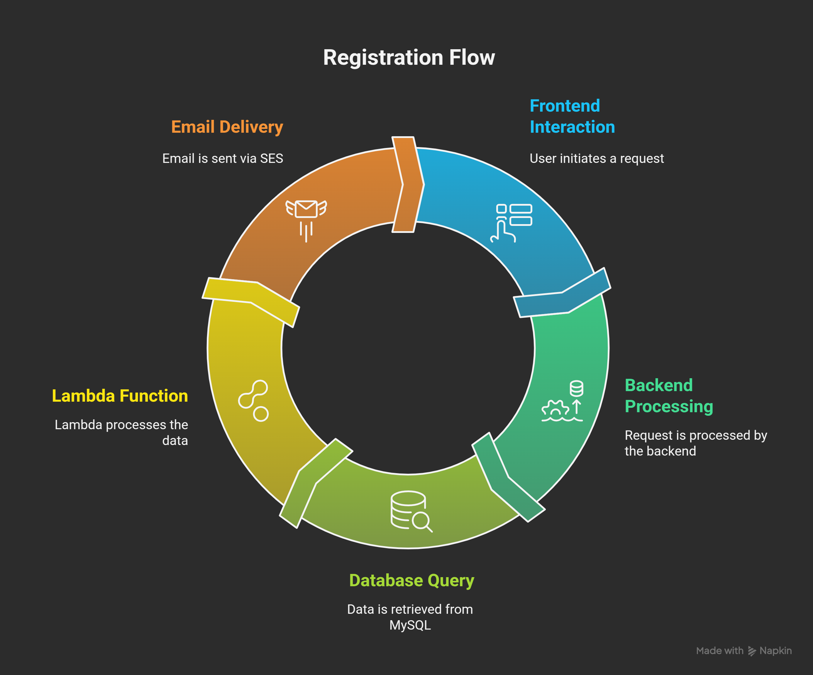

# Event Registration System

##  🚀 Demo

Watch a quick demonstration of Event Registration Application flow.


## 📌 Description

A full-stack event registration system built on AWS, designed to automate participant intake, qualification, and communication. The application features a web-based registration form, real-time data validation using an LLM (via AWS Lambda), and automated decision-based email notifications using AWS SES.

This app offers a modern solution to managing event registrations by reducing manual effort, improving participant filtering, and enabling faster communication — all with the help of cloud-native technologies and AI.

---

## 🎯 Problem It Solves

Traditional event registration workflows often rely on manual processes like:
- Collecting participant data through forms and spreadsheets

- Manually shortlisting and validating candidates
- Delays in notifying applicants
- Lack of automation and scalability

This project addresses these issues by:
- ✅ **Automating the registration workflow** from form fill to final email
- ⚙️ **Triggering real-time LLM-based validation** to filter participants smartly
- 📬 **Sending automated email notifications** based on AI decisions
- ☁️ **Leveraging AWS cloud services** for scalability, reliability, and flexibility

Whether it's a tech event, bootcamp, or workshop, this app streamlines the registration process end-to-end — saving time for organizers and improving experience for participants.


## 📝 Application Flow & Description


### 1. Frontend (HTML/CSS)
- Displays a responsive registration form.
- Fields: Name, Email, Phone Number, Designation, IT Experience.
- Drag-and-drop selectors for:
  - **Designation:** DevOps Engineer, Cloud Engineer, SRE, Frontend Developer, etc.
  - **Experience:** Fresher, 0–2, 2–5, 5–7, 7–10, 10+ years.
- All fields are mandatory before submission.

### 2. Backend (Python)
- Handles form submissions and inserts data into the MySQL database.
- Reads DB credentials securely using `.env` file.
- Triggers AWS Lambda function after storing the data.

### 3. Database (MySQL on EC2)
- Stores all registration data in a structured table format.
- Includes fields for all user inputs (name, email, phone, etc.)

### 4. AWS Lambda + LLM Integration
- Triggered upon new record insert.
- Uses OpenAI or other LLM APIs to evaluate:
  - Experience level
  - Designation match
  - Event seat availability
- Makes a decision: **Confirmed**, **Waitlisted**, or **Rejected**.

### 5. AWS SES (Simple Email Service)
- Sends a confirmation or rejection email to the user based on LLM decision.
- Uses pre-defined email templates for different decision outcomes.




## 🚀 Quick Start

### Prerequisites

Before starting, ensure you have:

- ✅ AWS Account (with access to EC2, Lambda, SES)
- ✅ EC2 Instance (for hosting frontend, backend, and MySQL)
- ✅ Python 3.8+ installed on EC2
- ✅ OpenAI API Key (for LLM integration)
- ✅ Verified email in AWS SES (for sending notifications)
- ✅ IAM Roles with necessary permissions

### Installation

1. **Clone the Repository**
   ```bash
   git clone https://github.com/yourusername/Event_Registration_System.git
   cd Event_Registration_System
   ```

2. **Setup MySQL**
   - Follow instructions in `MYSQL_SETUP.md`
   - Create database and tables
   - Configure user permissions

3. **Setup Lambda Function**
   - Follow instructions in `LAMBDA_SETUP.md`
   - Create deployment package
   - Configure environment variables

4. **Setup Backend**
   - Follow instructions in `BACKEND_SETUP.md`
   - Configure environment variables
   - Start the application

## ⚙️ Configuration

### Required Environment Variables

1. **Backend (.env)**
   ```
   FLASK_DEBUG=False
   SECRET_KEY=your-secret-key
   DB_HOST=your_mysql_host
   DB_USER=your_db_user
   DB_PASSWORD=your_db_password
   DB_NAME=your_db_name
   AWS_REGION=your_aws_region
   AWS_ACCESS_KEY_ID=your_aws_access_key
   AWS_SECRET_ACCESS_KEY=your_aws_secret_key
   LAMBDA_FUNCTION_NAME=your_lambda_function
   ```

2. **Lambda Function**
   ```
   AWS_REGION=your_aws_region
   DB_HOST=your_mysql_host
   DB_USER=your_db_user
   DB_PASSWORD=your_db_password
   DB_NAME=your_db_name
   OPENAI_API_KEY=your_openai_api_key
   SENDER_EMAIL=your_verified_ses_email
   ```


## ☁️ AWS Services Configuration


#### 🖥️ EC2 (Elastic Compute Cloud)

- **Purpose:** Hosts the frontend, backend (Flask API), and MySQL database.
- **Recommended Instance Type:** t2.medium (for testing/small scale)
- **Security Groups:**
  - Allow **SSH (port 22)** for access (restricted to your IP)
  - Allow **HTTP (port 80)** or **HTTPS (port 443)** for frontend
  - Allow **Flask API port (e.g., 5000)** if used directly
  - Allow **MySQL (port 3306)** to connect to the database


#### 🗃️ MySQL on EC2

- **Purpose:** Stores user registration data
- **Configuration:**
  - Create a database `event_registration`
  - Create a user with limited privileges (SELECT, INSERT)
  - Allow access from Lambda/EC2 instance within the same VPC/security group
- **Best Practice:** Use RDS for production and backups

#### 🔁 AWS Lambda

- **Purpose:** Validates user data using LLM (OpenAI) and triggers email
- **Runtime:** Python 3.10+
- **Trigger:** Can be invoked after DB insert or by the backend app

## 📚 Documentation

- [MySQL Setup Guide](MYSQL_SETUP.md)
- [Lambda Setup Guide](LAMBDA_SETUP.md)
- [Backend Setup Guide](BACKEND_SETUP.md)


## 📄 License

This project is licensed under the MIT License - see the [LICENSE](LICENSE) file for details.


## 🤝 Contributing

Contributions are welcome! If you have suggestions or want to add a feature, feel free to:

1. Fork the repository
2. Create your feature branch
3. Commit your changes
4. Push to the branch
5. Create a Pull Request

If you'd like to connect or discuss ideas, feel free to reach out on [LinkedIn](https://www.linkedin.com/in/balakonda-reddy/).
